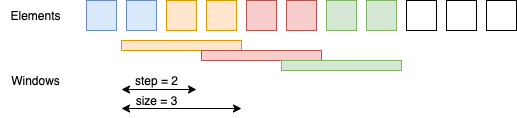

Window operation
=====

Window operation is not a [window function](https://en.wikipedia.org/wiki/Window_function) yet but predecessor of that operation. This function allows you to group a bunch of samples together and then move over the stream evenly. That function is something that you will use to run an [FFT analysis](fft-operation.md) after, and many other things you'll be able to do with a set of samples while processing the stream.

Window has two main characteristics: `step` and `size`. Both of this values are of integer types. The `size` of the window is the maximum amount of elements will be in the window. The maximum because, the stream may end and the window will not be full. The `step` is how the window is moving forward. The step defines how may elements overlap between different windows (if `step` < `size`), or if they won't overlap at all (if `step` ≥ `size`), if `step` > `size`, it means some of the elements will be dropped between windows, it'll make gaps in a stream. Please follow the figure below -- the colored one are the windows, the white boxes are elements that are not read yet. Windows have overlap as the `step` < `size` 


Figure 1. Understanding of windows.

To create a window over stream of any type you can just call the `window()` function. You'll need to specify the `size` and optionally `step` as parameters, if the `step` is not specified it is assumed to be equal to `size`. The `size` and `step` must be more than 0. 

If you use the stream over the type different from `Sample` you'll need to specify the function that generates Zero element. It is required for merging different windows together, as during merge the actual length of the function may not conform and needs to be aligned.

Here is how you can create the window over the `BeanStream<Sample>`:

```kotlin
val stream = anySampleStream()

// the size of the window is 512 samples and the step assumed to be the same.
stream.window(512)

// the size of the window is still 512 samples, however the step now is 128 samples.
stream.window(512, 128)

// we can use named parameters for better readability
stream.window(
    size = 512, 
    step = 128
)
```

The output of this stream is the stream of windowed type, in this case it is `BeanStream<Window<Sample>>`.

If you want to use window operation over the different type of the stream, you would need to define the [Zero element](zero-element.md) function. Let's imagine we have a stream of integer numbers `BeanStream<Int>`, the zero element on this is simple `0`, this is how it would look like:

```kotlin
input { (idx, _) -> idx.toInt() } // create a BeanStream<Int>
        .window(128) { 0 } // create a window over that stream, specifying the zero element function.
```

**Attributes of the window**

As was mentioned above, the window has two main characteristics: `size` and `step`. Both of them can be found inside the `Window<T>` object, also there are other things you may find useful:

* `elements` -- the content of the window. Not empty list (at least one element must exist) of the elements that are attributed to that window, please be aware that the list size may not be the same size as the window size, but it definitely can be larger.
* `zeroEl` -- function that returns a [Zero](zero-element.md) for the specified windowed type.
* `merge` -- function that merges two windows of the same size and step. If in fact the windows are different length the `zeroEl` function is used to align the lengths.

A following operations you may use over the windowed stream:

* [map](map-operation.md) -- you may map a window internal values 1-to-1, or create a differently sized window, or even downsample the stream and convert a window into one sample.
* [merge](merge-operation.md) -- merge the windows of the same characteristics and types.
* [scalar operations](arithmetic-operations.md) -- sum, subtract, divide, multiply by scalar values out-of-the-box if you've windowed the sample stream.
* [projection](projection-operation.md) -- projection over the any windowed stream is built-in however don't forget to register your type calculator for a non-built-in types, it is called internally.
* [FFT analysis](fft-operation.md) -- run an FFT analysis over the stream.

**Output**

The window operation mainly is used as interim operation and allows to perform further analysis, so it has no builtin outputs, however you may define your [own CSV output](../outputs/csv-outputs.md#user-defined-csv-output) if that is required.