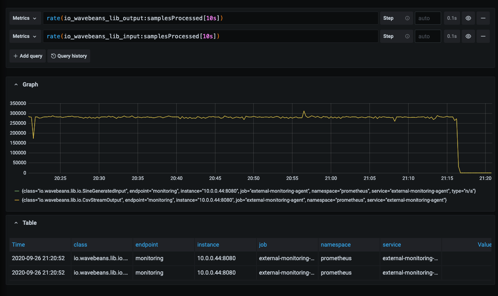

# Monitoring

WaveBeans uses metric approach to be monitored, and can be connected to a variety of monitoring systems, i.e. Prometheus, as well as provides the same metrics for application. And it always easy to develop your own.

## Metrics

The list of metrics and there description you may find in the source file [io/wavebeans/metrics/Metrics.kt](https://github.com/WaveBeans/wavebeans/blob/master/metrics/core/src/main/kotlin/io/wavebeans/metrics/Metrics.kt).

## Prometheus

In order to use Prometheus, first of all you need to make sure the `metrics.prometheus` project is in your classpath. This is the small library that spins up the Prometheus server and listens to WaveBeans metrics within the current JVM instance.

In order to add it just update the gradle file with the new dependecny. I.e. `build.gradle.kts`:

```kotlin
dependencies {
    implementation("io.wavebeans.metrics:prometheus:$wavebeansVersion")
}
```

In your application you'll need to instantiate the `io.wavebeans.metrics.prometheus.PrometheusMetricConnector` specifying the port the Prometheus HTTP Exporter will start on, the connector should be registered within `io.wavebeans.metrics.MetricService`:

```kotlin
val connector = PrometheusMetricConnector(port = 8080)
MetricService.registerConnector(connector)
```

Once it is done the Prometheus will be able to export the WaveBeans metrics collected within the current JVM instance.

### Metrics collection in distributed mode

The previous approach works well while you're running your jobs within one JVM: either in single-threaded or multi-threaded mode. But it doesn't allow you to leverage the metrics in Distributed mode, where separate process (called Facilitators) are started. In order to monitor the jobs running on Facilitators you need to enable that in configuration.

First of all we need to make sure the `metrics.prometheus` artifact is in classpath of the java process. If you're using standard distribution the start up script allows adding extra classpath entries by specifying the `EXTRA_CLASSPATH_AFTER` environment variable. The prometheus integration library is presented in the distribution archive under `extra/prometheus` directory, provide those extra libraries at the Facilitator start.

Facilitator sets up the connectors itself when you specify it in its configuration:

```hocon
facilitatorConfig {
    metricConnectors: [
        {
            clazz: "io.wavebeans.metrics.prometheus.PrometheusMetricConnector",
            properties: {
                "port" : "8080"
            }
        }
    ]
}
```

Once the facilitator started the Prometheus may connect to the configured port and start collecting metrics.

For example:

1. Start facilitator with prometheus configured (assuming you're on Linux/MacOS with bash or zsh). 
   
    * Create config file `config.conf`:
    
    ```hocon
       facilitatorConfig {
        communicatorPort: 2440,
        threadsNumber: 1,
        metricConnectors: [
            {
                clazz: "io.wavebeans.metrics.prometheus.PrometheusMetricConnector",
                properties: {
                    "port" : "8080"
                }
            }
        ],
        communicatorConfig: {
            maxInboundMessage: 16777216
        }
       }
    ```
   
   * Register the additional libraries:
   
   ```bash
   export EXTRA_CLASSPATH_AFTER="<WAVEBEANS_HOME>/extra/prometheus/*"
   ```
   
   * Start facilitator, you should the `Started server on 2440` message. You may find logs under `logs/` folder in the current directory.
   
   ```bash
   wavebeans-faciliator config.conf
   ```
2. Configure Prometheus to collect the metrics. Here it depends on your setup. Follow Promethues documentation, and specifically [Prometheus JVM Client](https://github.com/prometheus/client_java) which is used as a client library.
3. Run some job, i.e. with CLI tool:
    ```bash
    wavebeans -e "440.sine().toCsv(\"file:///users/asubb/tmp/out.csv\").out()" --time --verbose -l 127.0.0.1:2440 -m distributed -p 1 -t 1
    ```
4. Query metrics in Prometheus or Grafana with following queries:

    * To count rate of samples on the input `rate(io_wavebeans_lib_input:samplesProcessed[10s])`
    * To count rate of samples on the output `rate(io_wavebeans_lib_output:samplesProcessed[10s])`

You'll see something like this



## Usage within application

WaveBeans provides the collector abstraction that helps collect metrics either during Local or Distributed execution. Collectors are created on per metric basis.

### Creating in Local mode

To create the collector for the specific metric you can just call a `.collector()` method:

```kotlin
val collector = samplesProcessedOnOutputMetric.collector(
    refreshIntervalMs = 5000, 
    granularValueInMs = 60000
)
```

Parameters are:
* `refreshIntervalMs` - the interval in milliseconds the collector will perform the job with, to disable automatic fetching in separate thread specify 0. By default, 5000ms is set.
* `granularValueInMs` - the amount of time the metric will be accumulated for to represent the single value (roll up), that means for that period of time singular events won't be distinguishable. By default, is set to 1 min (60000ms), if you set it to 0, it won't do any roll up, though it may affect the memory consumption and overall performance.

### Creating in Distributed mode

To create a collector for a metric in distributed mode:

```kotlin
val facilitatorsLocations = listOf("10.0.0.1:40000", "10.0.0.2:40000")
val collector = samplesProcessedOnOutputMetric.collector(
    downstreamCollectors = facilitatorsLocations, 
    refreshIntervalMs = 5000, 
    granularValueInMs = 60000
)
```

That will automatically start the collection of the metric from downstream facilitators in the separate thread, downstream collectors are created and registered automatically for the specified metric.

Additional parameters to local mode is:
* `downstreamCollectors` - the list of the servers to collect from in format `<host-or-ip-address>:<port>`, in most cases that would be facilitator locations.
* Additionally `refreshIntervalMs` first iterations are spent to connect to downstream collectors unless all of them are connected instead of performing the actual job.

### 

To collect all values from the collector, you may call `collectValues()`, which return the list of `TimedValue<T>`, where `T` is the type return by your metric. Once the method is called, the internal state of the collector is cleaned up up to the time point you've specified , so make sure you've stored the values, you won't get them once again.

Once you've finished working with the collector you need to close it to free up all resources:

```kotlin
collector.close()
``` 

## Connecting your own monitoring system

To create your own implementation of the metric consumer, implement the interface `io.wavebeans.metrics.MetricConnector` and register it with `io.wavebeans.metrics.MetricService.registerConnector`. Please make sure the methods of this implementation are very fast as they are called synchronously during execution and it is up to specific implementation to make it fast or asynchronous. 
